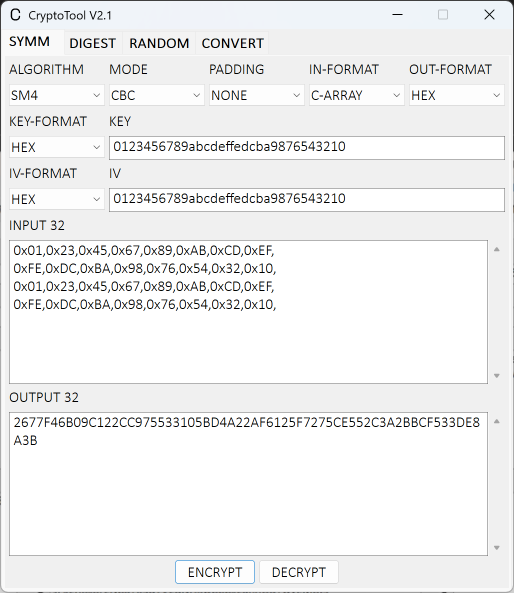
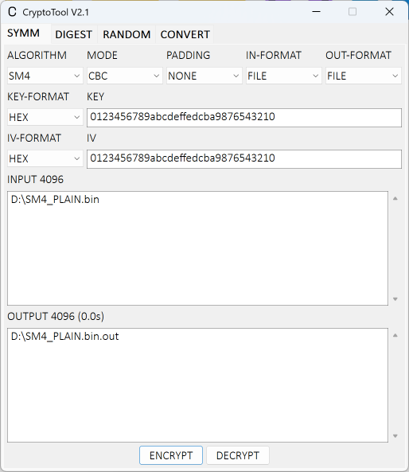

# CryptoTool
## Build
To build CryptoTool, the following tools are required:
* CMake
* Microsoft Visual C compiler
* OpenSSL library (libcrypto.lib) and headers

Or download the exeutable directly from the [Release](https://github.com/nonikon/CryptoTool/releases) page.

## Accelerators
| Key | Note |
| --- | --- |
| ESC | Exit |
| CTRL+W | Exit |
| CTRL+T | Terminate background thread |
| CTRL+ENTER | Start |
| CTRL+TAB | Switch tab window |

## Screenshots

